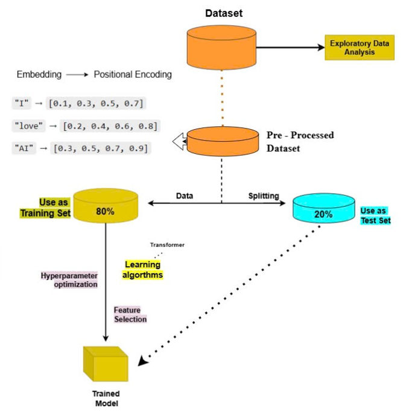
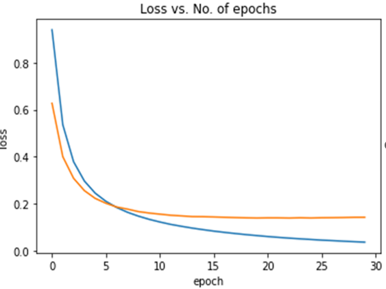
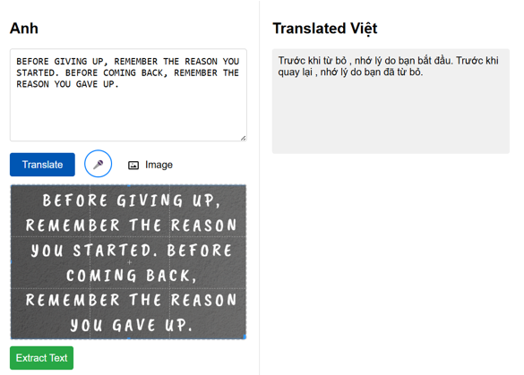

# 🇬🇧➡️🇻🇳 Machine Translation: English → Vietnamese using Transformer

A powerful neural machine translation system built with PyTorch and Transformer architecture. Supports translation from **text**, **speech**, and **image (OCR)** into Vietnamese.

<p align="center">
  
</p>

---

## 📑 Table of Contents

- [🔍 Project Overview](#-project-overview)
- [📁 Dataset Collection](#-dataset-collection)
- [🧹 Preprocessing Pipeline](#-preprocessing-pipeline)
- [🧠 Model Architecture](#-model-architecture)
- [🔊 Speech & OCR Support](#-speech--ocr-support)
- [💻 User Interface](#-user-interface)
- [🚀 Getting Started](#-getting-started)
- [📌 Notes](#-notes)
- [✍️ Author](#️-author)

---

## 🔍 Project Overview

This project focuses on building a Vietnamese-English translation system using deep learning techniques. It leverages Transformer models for translation and integrates modules for:

- 📝 Text-based translation
- 🗣️ Speech-to-text translation (via Whisper)
- 🖼️ Image-to-text translation (via OCR)

---

## 📁 Dataset Collection

We combine data from three high-quality bilingual corpora:

1. **TED Talks Corpus** – Natural speech subtitles, diverse topics.
2. **OPUS Project** – Massive open multilingual parallel corpus.
3. **Kaggle Translation Dataset** – Clean and easy to access.

➡️ Total: ~1 million parallel sentence pairs.

---

## 🧹 Preprocessing Pipeline

Steps included:

- Sentence segmentation
- Word tokenization (using `underthesea` for Vietnamese)
- Lowercasing and whitespace cleaning
- Removing noisy/invalid samples
- Padding & vectorization using Word2Vec

<p align="center">
  
</p>

---

## 🧠 Model Architecture

The translation engine is built using PyTorch’s implementation of the **Transformer architecture**.

- 50 training epochs on Google Colab (~12h)
- Achieved **87% accuracy**
- Training on 80% of data, validated on 20%

<p align="center">
  
</p>

---

## 🔊 Speech & OCR Support

- 🎙️ **Speech-to-text** using [OpenAI Whisper](https://github.com/openai/whisper)
- 🖼️ **Image-to-text** using OCR (e.g., Tesseract)
- 🔄 Translation after text is extracted

---

## 💻 User Interface

The system supports:

- Typing or pasting text to translate
- Uploading an image to extract & translate text
- Using microphone input for real-time voice translation

<p align="center">
  
</p>

---

## 🚀 Getting Started

```bash
git clone https://github.com/PVL-Linh/Machine-translation-English-Vietnamese.git
cd Machine-translation-English-Vietnamese

